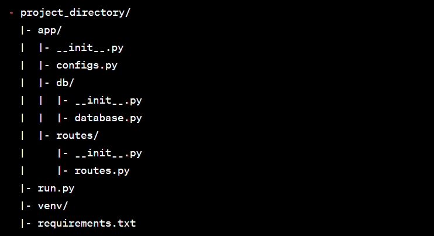

# Broadbil_Task
Python backend task from Broadbill.

# Installation
Describe the installation steps required to set up the project on a local machine. Include any prerequisites and specific package versions, if applicable.

$ pip install -r requirements.txt

# Usage
Explain how to use the project, including any necessary configurations or setup steps.

Update the app/configs.py file with the required configurations, such as the JWT secret key and Swagger details.
Run the Flask application using the run.py script.
Access the endpoints using an API client (e.g., Postman, cURL).

# Folder Structure
Provide an overview of the project folder structure. Use a tree-like structure or bullet points to illustrate the hierarchy and organization of different files and directories.

# Swagger Documentation
Explain how Swagger documentation is integrated into the project. Include the necessary steps to enable Swagger and how to access the Swagger UI.

## Install the required packages:

Add the following packages to your requirements.txt file:
Copy code
Flask
Flask-JWT-Extended
flasgger
Install the dependencies using pip install -r requirements.txt.
Implement Swagger in your Flask application:

Import the necessary modules in your __init__.py file.
Initialize Swagger with your Flask application using Swagger(app).
Annotate your routes with Swagger documentation using docstrings or @swag_from decorators.
Run your Flask application and access the Swagger UI at http://localhost:5000/apidocs.
Contributing
Explain how others can contribute to the project. Include guidelines for bug reports, feature requests, and pull requests.

# License
Specify the license under which the project is released.

